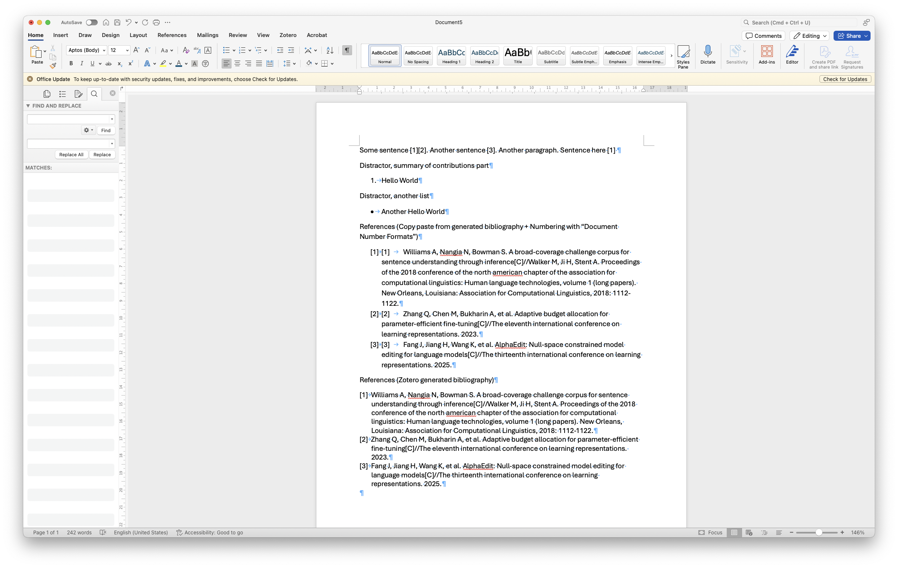

- [GB 7714](GB-T-7714—2015（顺序编码，双语，姓名不大写，无URL、DOI，引用与正文平齐，非折叠，解除中文语言锁定）.csl) is for Zotero plugin, to use GB 7714 citation style.
- [ZoteroLinkcitation.bas](ZoteroLinkCitation.bas) add cross-reference to Zotero Citation.
- [ConvertZoteroToWordCrossRef.bas](ConvertZoteroToWordCrossRef.bas) convert Zotero Citation to Word Cross Reference.

    Note 1: [ConvertZoteroToWordCrossRef.bas](ConvertZoteroToWordCrossRef.bas) is irreversible. Adding/Editing Citation with Zotero plugin will not work properly.

    Note 2: Before running the macro, copy the Zotero generated bibliography, create a "Numbering" / numbered list from the "Home" menu, paste without foramtting (in MacOS, Command+Shift+V) the Zotero generated bibliography.

    Note 3: After running the macro script, go to "Zotero" menu and click "Unlink Citations". Then, remove the Zotero generated bibliography.

    Note 4: You can automatically remove the extra `[1] \t ...` from the copy pasted without formatting bibliography with the Word Find and Replace. Use Wildcards, the regex is `\[[0-9]{1;2}\]^t`.

    